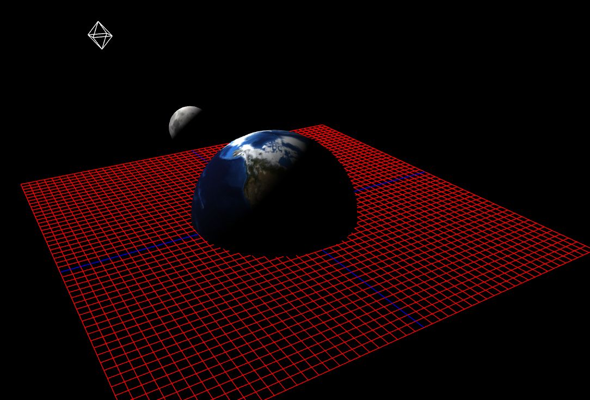
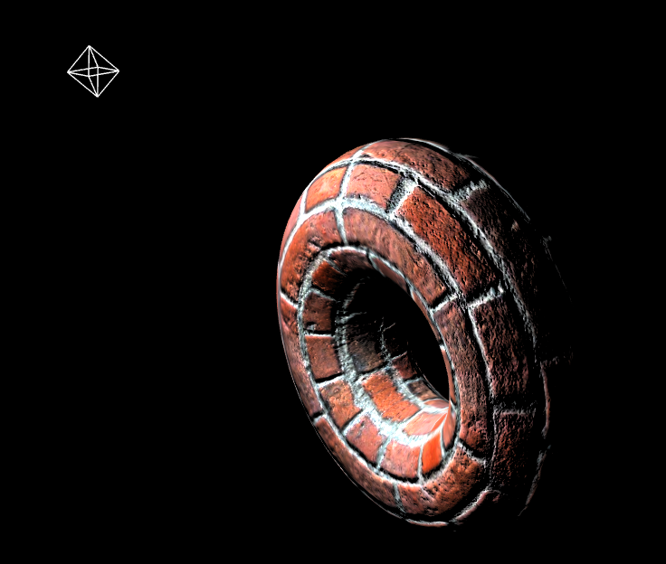

### To start project:
    Simply use "npm install" and then "npm start", project going to start at localhost:9966
    To see the bricky circle, change start command's file 
    sketch.js to torus-metarial.js in package.json file